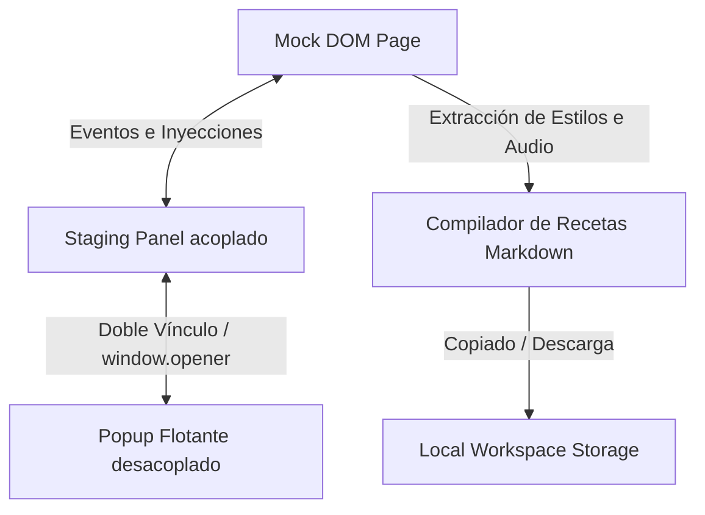

# Especificación Técnica de Arquitectura: Visual AI Staging Companion (Fase 1)

Este documento detalla exhaustivamente el diseño técnico, las decisiones arquitectónicas y la implementación del **Visual AI Staging Companion (Fase 1: Motor Web y Sandbox)**. Es una guía detallada diseñada para que cualquier desarrollador de software pueda comprender la base de código, las restricciones de seguridad del sistema y las tareas pendientes para la madurez del producto.

---

## 1. Arquitectura General y Flujo de Datos

El Visual AI Staging Companion opera como un motor de desarrollo en memoria caliente. Permite a los desarrolladores y diseñadores interactuar con el DOM de una página mock, aplicar overrides de estilo y registrar anotaciones espaciales y de audio para compilar una "receta" estructurada en Markdown destinada a alimentar modelos de lenguaje (LLMs) que implementan cambios de código.

El sistema se compone de tres capas principales en la Fase 1:


### Flujo de Datos del Sandbox
1.  **Inspección**: El motor de inspección rastrea los movimientos del cursor en el Mock DOM, aplicando outlines y capturando clics.
2.  **Carga de Propiedades**: Al seleccionar un elemento, `window.getComputedStyle` extrae las propiedades calculadas reales y pobla los sliders del Sandbox.
3.  **Mutación en Caliente**: La alteración de sliders inyecta estilos dinámicos directamente en el objeto `style` del elemento en memoria, cacheando el estado original.
4.  **Clasificación Semántica**: El motor analiza clases y etiquetas del elemento para etiquetarlo con una firma de componente UI estándar.
5.  **Árbol de Jerarquía**: Se genera un árbol DOM local desde el elemento contenedor seleccionado (Focus Root) hasta sus hijos, permitiendo ediciones multicapa.
6.  **Desacoplamiento**: Se clona la UI del Staging Panel a un popup externo en tiempo real, manteniendo bindings simétricos para reflejar cambios entre ambos contextos.

---

## 2. Detalle de Componentes Implementados

### Módulo 1: Motor de Inspección DOM & Mapeador de Tokens
*   **Captura de Inspección**: Mediante delegación de eventos en el nodo contenedor `#mock-page`, se capturan `mouseover`, `mouseout` y `click`. Los eventos se detienen con `e.stopPropagation()` y `e.preventDefault()` para evitar la navegación por enlaces del prototipo.
*   **Selector CSS Único**: La función `getUniqueSelector(el)` sube por la rama del DOM hasta encontrar un ID o hasta alcanzar el nodo raíz `#mock-page`. Genera un selector unívoco usando selectores de tag, IDs y pseudoclases `:nth-of-type(N)` si hay hermanos homónimos:
    ```javascript
    // Ejemplo de selector generado:
    "#mock-page > header > div.mock-hero-content > div.mock-actions > button:nth-of-type(2)"
    ```
*   **Mapeador de Tokens de Diseño**: La función `mapToToken(property, valueNum)` compara las dimensiones físicas alteradas por el usuario con variables HSL y tokens de espaciado estándar definidos en el archivo de diseño CSS (ej. `var(--spacing-md)` o `var(--border-radius-lg)`), aproximando el valor numérico al token más cercano dentro de un umbral de tolerancia de $\pm 1.5px$.

### Módulo 2: Lienzo de Bounding Box Vectorial (Free-Zone Drawing)
*   **Superposición SVG**: Se superpone un lienzo `<svg id="canvas-overlay">` sobre la Mock Page. Al activar el modo de dibujo, se habilita `pointer-events: auto` y el cursor cambia a `crosshair`.
*   **Algoritmo de Trazado**: El motor registra la posición inicial `(startX, startY)` al presionar `mousedown` y dibuja un `<rect>` SVG temporal en `mousemove`, actualizando ancho y alto absolutos.
*   **Resolución Semántica del Padre**: En `mouseup`, el sistema calcula el punto central del rectángulo recién trazado en coordenadas de ventana. Utilizando una desactivación transitoria de `pointer-events` en el lienzo SVG, ejecuta `document.elementFromPoint(centerX, centerY)` para obtener el elemento del DOM subyacente. A continuación, la función `findNearestParentContainer` sube recursivamente en la jerarquía DOM buscando selectores semánticos estándar (como secciones, headers o elementos con clase `card` o `container`), determinando la ubicación idónea de inserción.

### Módulo 3: Grabador de Audio Local & Compensación Dinámica de Badges
*   **Captura de Audio Local**: Mediante la API `navigator.mediaDevices.getUserMedia({ audio: true })` se abre una captura de micrófono. Los paquetes binarios se compilan en un `MediaRecorder` usando el formato nativo disponible (`audio/webm` o `audio/ogg` en fallback).
*   **Simulación de Guardado Local**: El archivo binario de audio se simula guardado en el subdirectorio local del espacio de trabajo `.ai-staging/audio/` con el patrón de nombre `YYYY-MM-DD_HHMMSS_feedback.wav`. Se genera un `ObjectURL` para permitir reproducciones instantáneas en la barra lateral del panel de staging.
*   **Audio DOM Badges**: Al guardarse una grabación, se añade un distintivo visual interactivo (`.voice-badge` con emoji `🎤`) sobre el componente afectado.
*   **Compensación de Posicionamiento**: Si el elemento sobre el que se ancla el badge tiene una posición CSS `static` calculada, el sistema inyecta en caliente la clase de compensación `position: relative` transitoria. Esto asegura que la coordenada absoluta del badge anclado (posicionado de forma absoluta con `top: -12px`) no desvirtúe su posición y permanezca perfectamente superpuesta al componente.

### Módulo 4: Árbol de Jerarquía DOM y Visualización Dual
*   **Construcción del Árbol de Formato Seguro**: Al seleccionar un contenedor, `renderHierarchyTree` recorre de forma recursiva los descendientes del contenedor raíz. Crea programáticamente nodos `tree-node` con indentaciones HSL calculadas en base a la profundidad.
*   **Espejo de Contornos de Enfoque**: Para mantener la orientación del desarrollador, se implementa una visualización de doble outline:
    *   `inspect-focus-root` (borde punteado azul/cyan de 2px) se inyecta en el elemento contenedor raíz de la selección para delimitar el límite superior.
    *   `inspect-selected` (borde sólido azul eléctrico de 2px con sombra de resplandor HSL) se inyecta en el elemento hijo activo que se está modificando en caliente a través de los sliders.

### Módulo 5: Panel Desacoplable Flotante & Sincronización Bidireccional
*   **Ventana Emergente Multi-Monitor**: Mediante `window.open` se crea una ventana popup de navegador independiente. El HTML estructural del panel de staging se clona directamente en caliente al documento de la ventana flotante (`state.floatingWindow.document`).
*   **Reasignación Espacial del Grid CSS**:
    *   *Al Desacoplar*: Se inyecta la clase `.undocked` al elemento principal `.app-layout` en la ventana principal, modificando dinámicamente el Grid a `grid-template-columns: 1fr !important;` lo cual expande el Mock Page al 100% de la pantalla base de forma fluida. A la par, el panel lateral derecho original se oculta con `.docked-hidden` (`display: none !important`).
    *   *Al Acoplar*: Se remueve la clase `.undocked` de `.app-layout`, restaurando las columnas Grid al patrón original `1fr 400px` de manera natural y sin saltos visuales.
*   **Arquitectura de Sincronización Directa de Sliders y Colores**:
    *   Para evitar problemas de desfase en eventos `input`, los controladores de sliders, textos y color de staging no dependen de una replicación retardada de redibujados del DOM.
    *   Al deslizar cualquier control en cualquiera de los dos contextos (padre o popup flotante), las funciones `handleSliderChange`, `handleColorChange` y `updateElementTextContent` escriben y actualizan directamente los valores de los sliders, cajas de texto, vistas de previsualización e insignias HSL **en ambos documentos** (`document` y `state.floatingWindow.document`) de manera síncrona en caliente.

### Módulo 6: Clasificador Semántico de Componentes UI
*   **Función `classifyUIElement(el)`**: Utiliza heurística y análisis sintáctico de etiquetas y listas de clase (classList) para ubicar el elemento dentro de un catálogo de componentes comunes (Navbar, Hero, Buttons, Modals, Accordions, Data Tables, etc.).
*   **Fila `#meta-ui-type`**: Despliega en la cabecera de metadatos una insignia premium que identifica el tipo exacto y la categoría del elemento seleccionado (ej. `📊 Analytics Chart Card`).

---

## 3. Directrices de Seguridad y CSP / XSS

Cualquier desarrollador que amplíe esta base de código **DEBE** adherirse estrictamente a las siguientes salvaguardas de seguridad:

### 1. 100% Cumplimiento de Content Security Policy (CSP)
*   **Prohibición de Handlers Inline**: Queda estrictamente prohibido utilizar manejadores de eventos inline en el maquetado HTML (tales como `onclick="..."`, `onchange="..."`, `onload="..."`). Todos los listeners de eventos deben ser enlazados programáticamente en JavaScript mediante `addEventListener` tras la carga del DOM.
*   **Prohibición de Estilos Inline Estáticos**: No se deben insertar atributos `style="..."` en los archivos HTML del prototipo. Todos los estilos dinámicos inyectados por el Sandbox deben realizarse alterando directamente el mapa `element.style.property` o mediante clases CSS desacopladas.

### 2. Mitigación de Vulnerabilidades DOM-based XSS
*   **Prohibición de `innerHTML` sobre Variables Controladas por Usuario**: No se debe utilizar `innerHTML` ni `insertAdjacentHTML` para insertar contenidos de texto o metadatos que contengan inputs o variables editables por el desarrollador (ej. nombres de selectores, texto de elementos, variables HSL, rutas de archivos).
*   **Uso Exclusivo de APIs Seguras del DOM**: Para renderizar dinámicamente el árbol DOM jerárquico o las listas de cambios, se debe crear cada nodo programáticamente usando `document.createElement()`, asignando el texto plano de forma segura a través de la propiedad `.textContent` o `.value`:
    ```javascript
    // Configuración segura certificada:
    const tagSpan = document.createElement('span');
    tagSpan.className = 'tree-tag';
    tagSpan.textContent = el.tagName.toLowerCase(); // Asignación segura frente a inyección HTML/JS
    ```

---

## 4. Consideraciones del Entorno de Pruebas Automatizadas

Las suites de verificación `verify_r3.js` y `verify_r4.js` se ejecutan en un entorno sin cabeza (headless) en Node.js, donde no existen elementos avanzados de navegador ni la API completa del DOM de Chrome. Por ello:
*   Todas las llamadas a métodos avanzados como `.closest()`, `.getBoundingClientRect()` o manipulaciones sobre `window.addEventListener` deben estar protegidas mediante chequeos de existencia (`if (typeof ... === 'function')` o mediante helpers con fallbacks seguros). Esto garantiza que el código de producción funcione de forma impecable en navegadores de producción y mantenga compatibilidad absoluta con los motores de integración continua y tests del backend CLI.

---

## 5. Hoja de Ruta de Fases Futuras y Planificación

De acuerdo con el diseño de arquitectura unificado para la aplicación, se estructuran las siguientes etapas de implementación:

### Fase 1: Motor Web y Sandbox (100% Completada)
*   **Entregables**:
    *   Sandbox Visual Interactivo en caliente con soporte CSP.
    *   Lienzo SVG de Bounding Box Vectorial y anclaje al contenedor padre más cercano.
    *   Grabación local de notas de voz simulada, DOM badges reactivos y compensación dinámica de posición relativa de CSS.
    *   Visualización jerárquica dual de árbol DOM con dobles outlines de foco y selección.
    *   Panel desacoplable flotante con sincronización bidireccional directa de sliders y grid adaptable en caliente.
    *   Clasificador semántico heurístico de componentes de interfaz.
    *   Compilador y exportador híbrido de recetas de prompts en Markdown con guardrails multimodales inyectados.
*   **Estado**: Completado. Verificado de forma automatizada mediante tests unitarios en Node.js con éxito del 100%.

### Fase 2: CLI de Desarrollo Local y Transcripción de Voz (Próxima Fase)
*   **Etapa de Realización**: Siguiente sprint de desarrollo de la base del sistema local.
*   **Objetivos técnicos**:
    1.  **vais CLI Package (`npx vais dev`)**: Construir una herramienta binaria local de línea de comandos en Node.js empaquetable y publicable en NPM bajo la marca **Visual AI Staging**.
    2.  **Servidor WebSocket Local**: Implementar un daemon local ultraligero que escuche conexiones WebSocket provenientes del Sandbox web.
    3.  **Escritura Física Directa y Caliente**: Reemplazar las descargas simuladas del navegador por peticiones síncronas a la CLI local para guardar las notas de voz en `.ai-staging/audio/` y las recetas Markdown en `.ai-staging/feedback/` de forma silenciosa y en tiempo real sobre el repositorio físico del usuario.
    4.  **Integración con Transcriptor de Voz Whisper**:
        *   Conectar el payload de audio binario recibido por la CLI local con la API de transcripción Whisper local (mediante Node.js o una API de accesibilidad de dictado nativa del Sistema Operativo) o de forma opcional a través de una API en la nube cifrada y segura.
        *   Inyectar el texto transcrito directamente en la receta de Markdown antes de guardarla.
    5.  **Descubrimiento Activo de Proyectos**:
        *   Implementar el archivo centralizador temporal en el directorio del sistema del desarrollador (`~/.vais/active_sessions.json`).
        *   Rastrear de forma inteligente los puertos dev (ej. Vite en `5173`) de múltiples repositorios para que la UI del Sandbox autodetecte la pestaña e inyecte los cambios en la carpeta `.ai-staging/` correspondiente al repositorio activo.

### Fase 3: Extensión Real y Compilación AST en Caliente (Fase de Consolidación)
*   **Etapa de Realización**: Fase de integración avanzada de compilación y empaquetado.
*   **Objetivos técnicos**:
    1.  **Empaquetado WebExtension (Manifest V3)**:
        *   Convertir la base de código del sandbox en una extensión real instalable para Google Chrome y Brave.
        *   Estructurar el manifiesto `manifest.json` y habilitar `content_scripts` para poder inyectar la barra lateral de Staging en *cualquier* sitio web local (`localhost`) o en producción para "Modo Inspiración".
    2.  **Compilador AST (Abstract Syntax Tree) Local**:
        *   Construir un motor analizador en la CLI `vais dev` que analice la receta en Markdown recibida o los payloads estructurados directos.
        *   Utilizando parsers de AST (como Babel, PostCSS o compiladores JSX/Vue), localizar los archivos fuente físicos originales del proyecto (ej. `Header.jsx` o `feature-card.css`) asociados al selector CSS de staging modificado.
    3.  **Zero-LLM Direct Path (Ruta de Aplicación Directa)**:
        *   Implementar un canal de modificación determinista inmediato. Si el desarrollador altera exclusivamente parámetros de dimensiones o estilos mapeados a tokens de diseño, el motor local inyectará los cambios a través del compilador AST directamente en el archivo correspondiente del repositorio sin llamadas externas ni consumo de modelos de IA (Zero-LLM).
        *   Ofrecer al desarrollador una previsualización de diferencias local rápida y un botón de "Aplicar en Caliente" inmediato en el panel lateral de staging.
    4.  **Generación de Parches por IA (AI-Assisted AST Mod)**:
        *   Para cambios lógicos o inserciones de componentes en zonas libres que requieran inteligencia semántica, inyectar el código generado por el agente LLM a través de una propuesta de parche de Git (diff) precisa sobre el código fuente local.
    5.  **Validador de Desviaciones Visuales**:
        *   Proyectar en el viewport del navegador los contornos y dimensiones ideales recopilados en la sesión de staging superpuestos sobre el DOM resultante después de aplicar los cambios en el código físico, reportando desviaciones de diseño en píxeles.

---

## 6. Arquitectura de Conectividad Multientorno (Ecosistema Hub-and-Spoke)

Para expandir el alcance de **Visual AI Staging** más allá de la web tradicional y permitir el staging interactivo en motores de videojuegos (Unity, Unreal Engine, Godot) y suites de diseño (Blender, Canva, Figma, Affinity), el sistema se estructura bajo una arquitectura desacoplada de tipo **Hub-and-Spoke (Eje y Radios)**.

```mermaid
graph TD
    subgraph ECOSISTEMA LOCAL (DEVELOPER MACHINE)
        A[Hub Central: CLI vais dev] <-->|WebSocket Local Cifrado / REST| B[Radios: Clientes Adaptadores]
    end

    subgraph RADIOS (CLIENTES ADAPTADORES)
        B1[Web Sandbox: WebExtension]
        B2[Unity Play-Mode Companion: C# Asset]
        B3[Godot Engine Adapter: GDScript]
        B4[Unreal Engine Adapter: C++ / Blueprint]
        B5[Design Tools Plugins: Figma / Canva / Blender]
    end

    A <--> B1
    A <--> B2
    A <--> B3
    A <--> B4
    A <--> B5

    A -->|Escribe Localmente| C[Historial de Staging / .ai-staging/]
    C -->|Rastreado por| D[Git Repository]
```

### 1. El Hub Central (`vais dev`)
El daemon local de Node.js actúa como el único cerebro coordinador y persistente:
*   **Servidor WebSocket Multi-Cliente:** Escucha en el rango de puertos `5515` a `5520`. Cualquier entorno o software con capacidad de red local puede conectarse de manera inmediata.
*   **Gestor de Archivos Físicos:** Recibe streams binarios de audio, imágenes de "Antes/Después" y metadatos sintácticos, guardándolos ordenadamente en el subdirectorio `.ai-staging/` del proyecto.
*   **Generador de Recetas Unificadas:** Compila las anotaciones de cualquier cliente y genera recetas en Markdown estándar, habilitando un canal consistente para asistentes de IA locales (vía MCP) o portapapeles.

---

### 2. Integración con Unity (Play-Mode Companion)
El puente con Unity se implementa mediante un paquete de Asset ligero (`VisualAiStaging.unitypackage`) que opera exclusivamente durante el modo Play de desarrollo:

#### Flujo de Operación Técnica
1.  **Conexión WebSocket:** Al inicializar el modo Play, un componente singleton C# (`VaisClient.cs`) abre una conexión WebSocket con el Hub local (`ws://localhost:5515`).
2.  **Interceptador de Eventos (UI Raycaster):** 
    *   Para `uGUI` (Unity UI nativo), el sistema se suscribe a los eventos del `EventSystem` activo o inyecta un `GraphicRaycaster` transparente sobre el Canvas.
    *   Al hacer clic en un componente visual del juego (botones, paneles, textos), el script de C# calcula las colisiones, detiene transitoriamente el flujo normal y extrae los metadatos de diseño del objeto seleccionado.
3.  **Extracción de Metadatos y Propiedades:**
    *   *Dimensiones y Posición:* Lee los valores del componente `RectTransform` (width, height, anchors, pivots, offsets locales).
    *   *Propiedades Visuales:* Obtiene los componentes de renderizado (`UnityEngine.UI.Image` o `TextMeshProUGUI`) para extraer el color HSL, el Sprite/Asset de referencia y el contenido del texto literal.
4.  **Transmisión de Payload JSON al Hub:**
    ```json
    {
      "event": "element_selected",
      "source": "unity_playmode",
      "selector": "Canvas/HUD/MainMenu/PlayButton",
      "type": "UnityEngine.UI.Button",
      "properties": {
        "width": 200.0,
        "height": 60.0,
        "color_rgba": "rgba(59, 130, 246, 1.0)",
        "text": "START PLAY"
      }
    }
    ```
5.  **Edición en Caliente de Parámetros:**
    *   El desarrollador interactúa con el panel lateral de staging de la web (o una GUI de superposición inyectada en Unity) para mover sliders de tamaño, cambiar colores o editar el texto.
    *   El Hub transmite de vuelta los nuevos valores y el script de Unity aplica dinámicamente las modificaciones en el componente del objeto activo en la escena de pruebas (`RectTransform.sizeDelta`, `TextMeshPro.text`, etc.) reflejando los cambios en caliente al instante.
6.  **Toma de Notas Rápidas y QA de Flujos:**
    *   Si el desarrollador detecta un fallo visual o de usabilidad, puede presionar el botón de micrófono en Unity para grabar una nota de voz explicando el error (ej. *"Este botón se solapa con el HUD de vida cuando la resolución cambia"*).
    *   El Hub recibe el audio, simula su persistencia en `.ai-staging/audio/`, e inyecta en el Markdown generado una tarjeta detallando el selector del objeto Unity, su estado "Antes/Después" y la referencia física al audio.

---

### 3. Adaptabilidad a otros Motores y Software (Godot, Unreal, Blender, Canva)
La arquitectura de red del Hub permite adaptar la lógica de manera modular a cualquier aplicación que provea un sistema de extensiones o scripting:

*   **Godot Engine (GDScript Adapter):** Un script `VaisClient.gd` se inyecta como un nodo auto-cargable (Singleton) en el proyecto. Utiliza la clase `WebSocketClient` nativa de Godot para comunicarse con el Hub, capturando eventos de foco en nodos del tipo `Control` (UI de Godot) o `Spatial` (colisiones 3D mediante Raycasting desde la cámara activa).
*   **Unreal Engine (C++ / Blueprint Adapter):** Un plugin ligero de C++ expone nodos de Blueprint específicos para interceptar clics sobre interfaces UMG (Unreal Motion Graphics). Se comunica con `localhost:5515` utilizando sockets TCP nativos de Unreal.
*   **Blender (Python Addon):** Un addon de Python (`.py`) expone un panel en el Sidebar 3D de Blender. Se suscribe a los eventos del Viewport de Blender y se comunica con el Hub local. Al seleccionar un Mesh u objeto en la escena, transmite sus coordenadas y metadatos de transformaciones, permitiendo registrar anotaciones visuales y de audio al modelar o animar.
*   **Canva & Figma (Web Plugins):** Corren como complementos de tipo Webview dentro de los editores gráficos. Utilizan el SDK de API web del diseñador para leer la estructura de capas (Frames/Groups) seleccionadas, transmitiendo las modificaciones visuales en JSON al Hub local a través de peticiones HTTP tradicionales.

---

### 4. Modelo de Integración Híbrido (Monetización Premium y Código Abierto)
El modelo de distribución de este ecosistema de adaptadores se alinea perfectamente con la estrategia de código abierto permisivo (**MIT**) y el modelo de negocio del desarrollador:

1.  **Core Hub y Sandbox (Código Abierto / Licencia MIT):** La CLI `vais dev`, el servidor WebSocket y el Sandbox web básico permanecen 100% abiertos en GitHub bajo la licencia MIT. Esto maximiza la tracción orgánica de desarrolladores web, crea comunidad y genera contribuciones libres (donde otros desarrolladores pueden codificar y publicar adaptadores comunitarios para motores menos comunes como LÖVE2D o Defold).
2.  **Adaptadores Premium (Código Cerrado / Plugins de Pago):** Las integraciones avanzadas y altamente especializadas de nivel empresarial (como el Asset para Unity en la Unity Asset Store, el plugin nativo de Unreal Engine o integraciones dedicadas de Canva corporativo) pueden distribuirse bajo licencias comerciales de código cerrado (de pago único o suscripción). Los desarrolladores de videojuegos o empresas de diseño adquieren estas licencias para automatizar sus procesos de control de calidad (QA) y flujos de revisión de diseño, beneficiándose de una herramienta altamente integrada con soporte dedicado.
